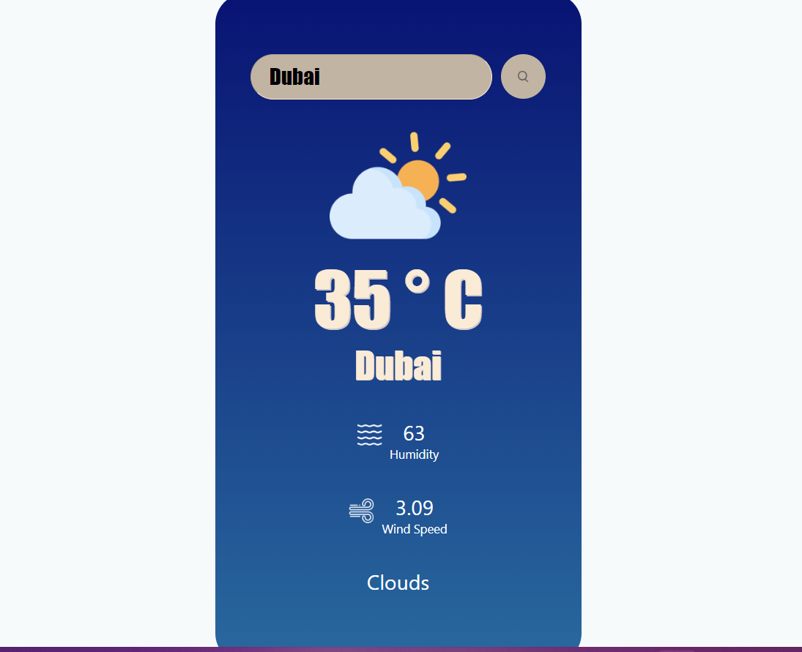

# React Weather App Readme



This is a simple weather app built using React that allows users to check the current weather conditions, including temperature, wind speed, and humidity for a specified location.

## Table of Contents

- [Features](#features)
- [Getting Started](#getting-started)
- [Usage](#usage)
- [Dependencies](#dependencies)
- [Contributing](#contributing)
- [License](#license)

## Features

- Real-time weather data retrieval using a weather API.
- Display of current temperature, wind speed, and humidity.
- Search functionality to find weather information for different locations.
- Clean and intuitive user interface built with React.

## Getting Started

Follow these instructions to set up the weather app on your local machine for development and testing purposes.

### Prerequisites

- Node.js and npm (Node Package Manager) must be installed on your machine. You can download and install them from [https://nodejs.org/](https://nodejs.org/).

### Installation

1. Clone the repository to your local machine using Git:

```bash
git clone https://github.com/your-username/react-weather-app.git
```

2. Navigate to the project directory:

```bash
cd react-weather-app
```

3. Install the project dependencies:

```bash
npm install
```

### Configuration

Before you can use the app, you need to obtain an API key from a weather data provider. This app is set up to work with [OpenWeatherMap](https://openweathermap.org/), but you can use any other weather API as well.

1. Sign up for a free OpenWeatherMap account to obtain an API key: [https://openweathermap.org/api](https://openweathermap.org/api).

2. Create a `.env.local` file in the project root and add your API key:

```
REACT_APP_API_KEY=your-api-key
```

Make sure to replace `your-api-key` with the actual API key you obtained.

### Usage

Now that you have installed the app and configured the API key, you can start using it.

1. Start the development server:

```bash
npm start
```

2. Open your web browser and go to [http://localhost:3000](http://localhost:3000) to view the app.

3. Enter a location in the search bar and press Enter or click the Search button to fetch the weather data for that location.

4. The app will display the current temperature, wind speed, and humidity for the specified location.

### Dependencies

The weather app relies on the following dependencies:

- [React](https://reactjs.org/): A JavaScript library for building user interfaces.
- [axios](https://axios-http.com/): A promise-based HTTP client for making API requests.
- [dotenv](https://www.npmjs.com/package/dotenv): A zero-dependency module that loads environment variables from a `.env` file.
- Other dependencies can be found in the `package.json` file.

## Contributing

Contributions to this project are welcome. If you would like to contribute, please follow these steps:

1. Fork the repository on GitHub.
2. Create a new branch for your feature or bug fix: `git checkout -b feature/your-feature-name`.
3. Make your changes and commit them: `git commit -m 'Add new feature'`.
4. Push your changes to your fork: `git push origin feature/your-feature-name`.
5. Create a pull request on the original repository.

## License

This project is licensed under the MIT License - see the [LICENSE](LICENSE) file for details.

---

Thank you for using the React Weather App! If you have any questions or encounter any issues, please feel free to open an issue on GitHub or reach out to the project maintainers. Enjoy checking the weather!
